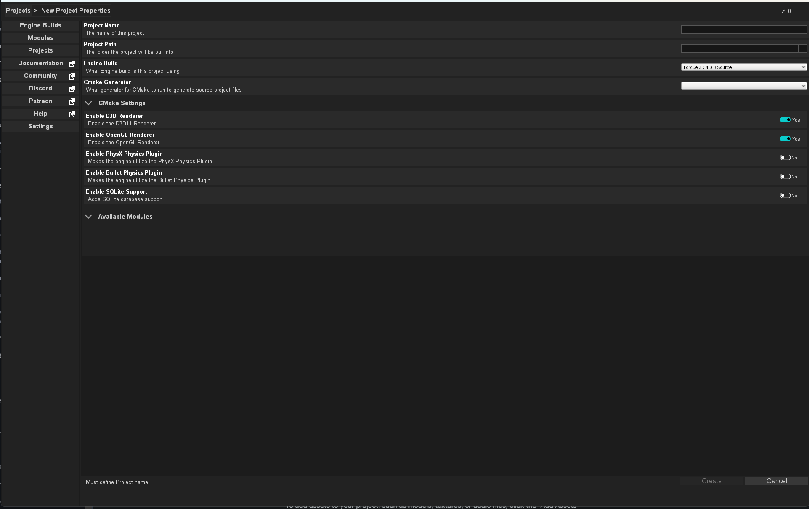

# SDK and Library Installation

Unsurprisingly, a piece of software as complex as a game engine requires supplemental SDKs(Software Development Kits) and Libraries in order to compile and run.

These are generally platform-specific, so the steps to set up will be handled by platform below

## Windows

To compile on Windows, the main thing that is required is the Windows SDK.

If you're installing Visual Studio (2022 is the recommended edition) then as long as you have these options enabled in the Visual Studio Installer:



.png>)

Then you'll have everything you need to compile Torque3D on Windows.

If you're not utilizing Visual Studio, or prefer to do it manually, then you'll need to download the SDKs from here:



Ensuring to have at least the current Windows 10 SDK.

## Mac OSX

On Mac, you only need to install XCode via the App store:



And install any additional components it requires.

As an additional option, Microsoft also offers Visual Studio for Mac, which can be acquired here:



## Linux

On Linux, there isn't a singular, simple route to ensure everything is installed and ready to go, however due to package managers, a series of commands can easily get your system up to speed and ready to go:

### Ubuntu

Binaries:

```
sudo apt-get install git build-essential nasm xorg-dev 
sudo apt-get install ninja-build gcc-multilib g++-multilib 
sudo apt-get install cmake cmake-qt-gui
```

Libraries:

```
sudo apt-get install libogg-dev libxft-dev libx11-dev libxxf86vm-dev 
sudo apt-get install libopenal-dev libfreetype6-dev libxcursor-dev 
sudo apt-get install libxinerama-dev libxi-dev libxrandr-dev 
sudo apt-get install libxss-dev libglu1-mesa-dev libgtk-3-dev
```

#### Additional Libraries <a href="#toc10" id="toc10"></a>

The file dialogs require GTK3 as well, so you will need to get the package for that if you do not already have it. The recommended command is this:

```
sudo apt-get install build-essential libgtk-3-dev
```

Depending on your project needs, you may need to have OpenSSL installed for libcurl support. The command line for that is here:

```
sudo apt-get install build-essential libssl-dev
```
